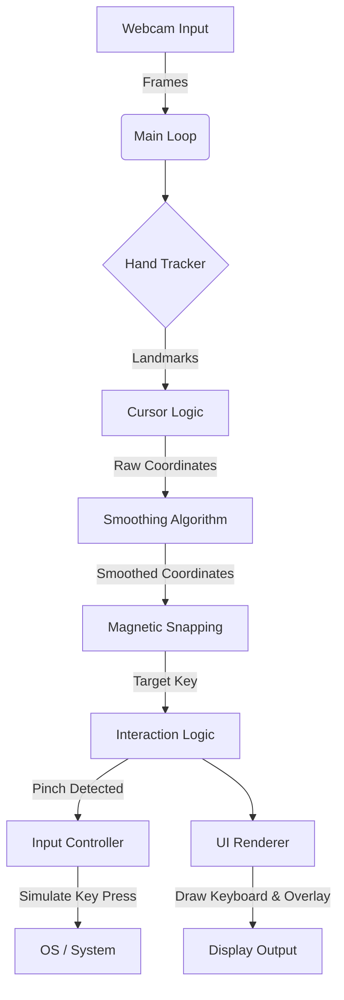

# Air Keyboard 

Air Keyboard V2 is a futuristic, touch-free virtual keyboard application that allows you to type using hand gestures in mid-air. Powered by computer vision and machine learning, it transforms your webcam into a powerful input device, offering a "Minority Report" style interaction experience.

## 🚀 Features

*   **Advanced Hand Tracking**: Real-time hand and finger tracking using MediaPipe.
*   **Virtual QWERTY Layout**: Full keyboard support including numbers, Shift, Space, Enter, and Backspace.
*   **Magnetic Cursor Snapping**: Intelligent cursor stabilization that "snaps" to keys for improved typing precision.
*   **Gesture Clicking**: Intuitive "Pinch-to-Click" mechanism (Index Finger + Thumb) for key selection.
*   **Motion Smoothing**: Algorithms to reduce jitter and ensure smooth cursor movement.
*   **Sci-Fi HUD Interface**: A visually striking, high-tech user interface with neon aesthetics and transparency.
*   **Dual Hand Support**: Capable of detecting and tracking multiple hands (logic optimized for primary hand interaction).

## 🛠️ Prerequisites

*   Python 3.8 or higher
*   A working webcam

## 📦 Installation

1.  **Clone the repository**
    ```bash
    git clone https://github.com/anaslari23/air-keyboard.git
    cd air-keyboard
    ```

2.  **Set up a virtual environment (Recommended)**
    ```bash
    python3 -m venv venv
    source venv/bin/activate  # On Windows use `venv\Scripts\activate`
    ```

3.  **Install dependencies**
    ```bash
    pip install -r requirements.txt
    ```

## 🎮 Usage

1.  **Run the application**
    ```bash
    python main.py
    ```

2.  **How to Type**
    *   **Move Cursor**: Move your hand in front of the camera. The system tracks your index finger tip.
    *   **Click/Type**: Pinch your **Index Finger** and **Thumb** together.
    *   **Visual Feedback**:
        *   **Cyan Border**: The key you are currently hovering over.
        *   **Green Fill**: The key you have successfully clicked.
    *   **Quit**: Press `q` on your physical keyboard to exit the application.

## 🏗️ Architecture

The application follows a modular architecture separating vision processing, game logic, and UI rendering.



## 📂 Project Structure

*   `main.py`: The entry point of the application. Handles the main execution loop, integrates all components, and manages application state.
*   `hand_tracker.py`: A wrapper around Google's MediaPipe library. Handles the initialization of the hand tracking model and processes video frames to extract hand landmarks.
*   `keyboard_layout.py`: Defines the virtual keyboard's structure, key positions, and handles the drawing of the "Sci-Fi" UI elements.
*   `requirements.txt`: Lists all Python dependencies required to run the project.

## ⚙️ How It Works

1.  **Capture**: The webcam captures video frames which are flipped to create a mirror effect.
2.  **Detection**: `HandTracker` processes the frame to find hand landmarks (joints).
3.  **Positioning**: The tip of the index finger is tracked as the primary cursor.
4.  **Smoothing**: To prevent jitter from natural hand tremors, a smoothing algorithm averages the movement between frames.
5.  **Snapping**: The "Magnetic" logic checks if the cursor is close to a key center and "snaps" it to the key, making it easier to target specific buttons.
6.  **Interaction**: The distance between the Index finger tip and Thumb tip is calculated. If it falls below a threshold (simulating a pinch), a click is registered.
7.  **Output**: The `pynput` library simulates a physical key press at the operating system level, allowing you to type into any application (Notepad, Browser, etc.).

## 🔮 Future Improvements

*   **AI Word Prediction**: Integrate an LLM or N-gram model to suggest words for faster typing.
*   **Custom Layouts**: Allow users to switch between QWERTY, Dvorak, or custom grid sizes.
*   **Gesture Shortcuts**: Add special gestures for common actions like "Copy", "Paste", or "Delete Word".
